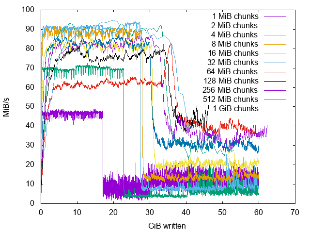

The results below are made using this tool on a: "Seagate Archive HDD ST8000AS0002"

```
# go build smr.go
# sudo ./smr -chunk $((32<<20)) -total $((60<<30)) -direct -sync -random -garbage | tee 32MiB.log
device size in bytes: 8001563222016
number of 33554432 byte sized chunks: 238465
logical block size: 512
0 7281479516160 33554432 4.2104137693780154e+07
1 6321017454592 67108864 8.674235413955158e+07
2 2491248803840 100663296 9.198207982763536e+07
3 4712988409856 134217728 9.726005511426853e+07
...
```

Usage of the tool:
```
# ./smr -h
Usage of ./smr:
  -chunk uint
        chunk size (default 512)
  -device string
        block device name (default "sdb")
  -direct
        use direct io
  -garbage
        write random data
  -human
        make output human readable
  -random
        write to random positions
  -scheduler string
        choose queue scheduler (default "noop")
  -sync
        sync each write
  -total uint
        total bytes to write (default 1048576)
```

Here the very noisy log visualized:

```
# gnuplot noisy.txt
```


Using exponential moving average to smooth out a little:
(FYI: EMA filtering causes nonlinear phase delays.)

```
# gnuplot ema.txt
```


One thing can be seen immediately from the diagrams above:
The size of the persistent cache used for the device management of the HDD must be around 32GiB.

